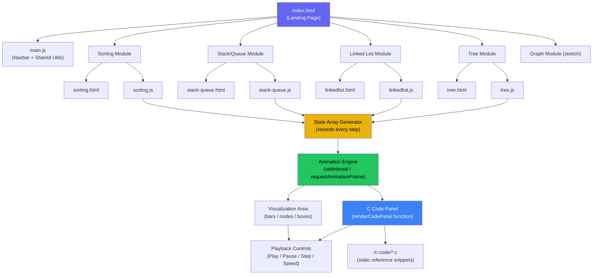

# Project Architecture — DSA Visualizer

This diagram shows how the pieces of the app connect to each other.

## Key Idea
Every module (Sorting, Linked List, Tree, etc.) follows the **same core pattern**:
1. Take input → generate a **state array** (list of "snapshots" of every step)
2. Feed the state array into the shared **Animation Engine**
3. Animation Engine updates both the **Visualization Area** and the **C Code Panel** in sync

This is why building the C Code Panel once (shared component) and reusing it everywhere saves a lot of duplicate work.
