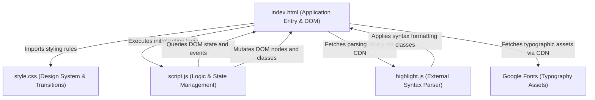
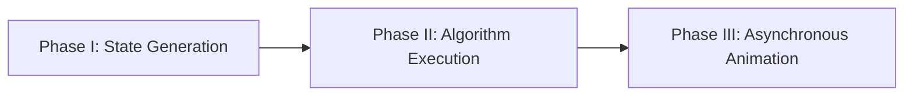

# System Architecture Documentation

This document delineates the structural interdependencies and execution paradigms governing the DSA Visualizer application.

## 1. Component Interconnectivity

The application architecture follows a modular, decoupled approach, leveraging standard web communication protocols.

## 2. File Responsibilities

| Component | Architectural Responsibility |
|---|---|
| `index.html` | Serves as the primary viewport and structural skeleton. It contains the semantic markup for the interactive controls, the SVG/Div-based visualization canvas, and the syntax-highlighted code panel. |
| `style.css` | Implements the visual presentation layer. It defines global CSS variables for theme consistency, establishes flexbox-based responsive layouts, and declares hardware-accelerated keyframe animations and transitions. |
| `script.js` | Functions as the core controller. It handles array generation algorithms, orchestrates the asynchronous sorting routines, and manipulates the DOM to reflect state changes over time. |

## 3. Core Algorithmic Execution Pattern

Regardless of the specific sorting methodology selected (e.g., Bubble Sort, Merge Sort), the application adheres to a uniform, three-phase execution lifecycle:

1. **State Generation:** The system procedurally instantiates a one-dimensional array populated with randomized scalar values, mapped proportionally to vertical DOM elements within the visualization canvas.
2. **Algorithm Execution:** The selected sorting algorithm traverses the array. Instead of instantaneous mutation, mathematical operations (comparisons and swaps) trigger state updates.
3. **Asynchronous Animation:** A custom asynchronous controller intercepts algorithm state changes, utilizing `Promise`-based delays to render sequential visual updates (color state shifts and height mutations), allowing users to observe computational progression in real-time.
