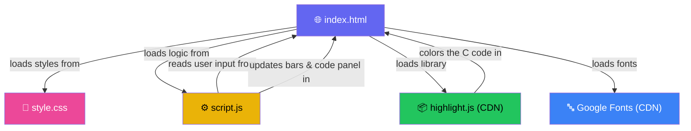
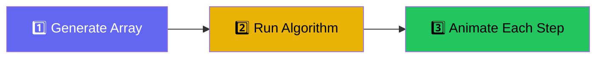

# Project Architecture — DSA Visualizer

This document shows how the different files in this project connect and work together.

## How the Files Connect

## What Each File Does

| File | Role |
|---|---|
| `index.html` | The main page — has the buttons, sliders, visualization area, and code panel |
| `style.css` | Controls how everything looks — dark theme, bar colors, animations |
| `script.js` | The brain — generates arrays, runs sorting algorithms, animates the bars |

## The Core Pattern

Every sorting algorithm in this project follows the same 3-step pattern:

1. **Generate** — Create a random array and draw it as bars on screen
2. **Run** — Execute the sorting algorithm step by step
3. **Animate** — At each step, change bar colors and heights so the user can see what's happening
