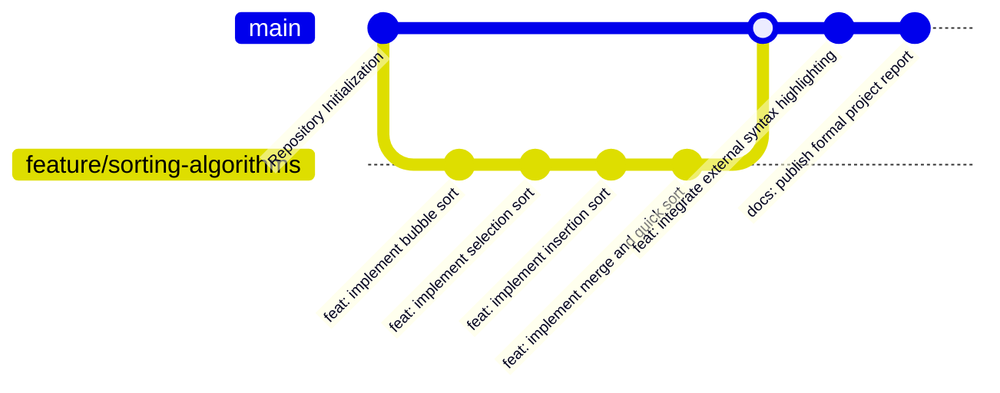
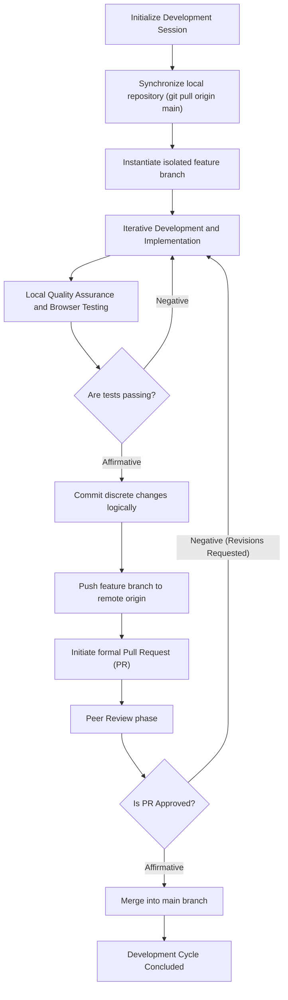

# Version Control and Repository Workflow

This document outlines the standardized Git and GitHub workflows utilized for source code management, collaboration, and continuous integration within the DSA Visualizer project.

## 1. Branching Strategy

The repository adheres to a strict feature-branching methodology to maintain the stability of the production environment. The `main` branch serves as the definitive, stable release candidate. All active development occurs on isolated, task-specific feature branches.

## 2. Standard Operating Procedure (SOP) for Development

Collaborators must adhere to the following procedural workflow to ensure code integrity and minimize integration conflicts:

## 3. Governance and Best Practices

To ensure a cohesive and conflict-free development environment, the following engineering rules are strictly enforced:

1. **Restricted Commits:** Direct commits to the `main` branch are prohibited. All modifications must be introduced via feature branches.
2. **Granular Branching:** Adopt a one-to-one mapping between branches and functional requirements (e.g., one branch per algorithm or distinct feature).
3. **Synchronization Protocol:** Developers must execute a remote pull prior to commencing any local modifications to preemptively mitigate merge conflicts.
4. **Semantic Commits:** Commit messages must adhere to conventional commit standards, providing clear, imperative documentation of the changes (e.g., `feat: implement recursive merge sort partitioning`).
