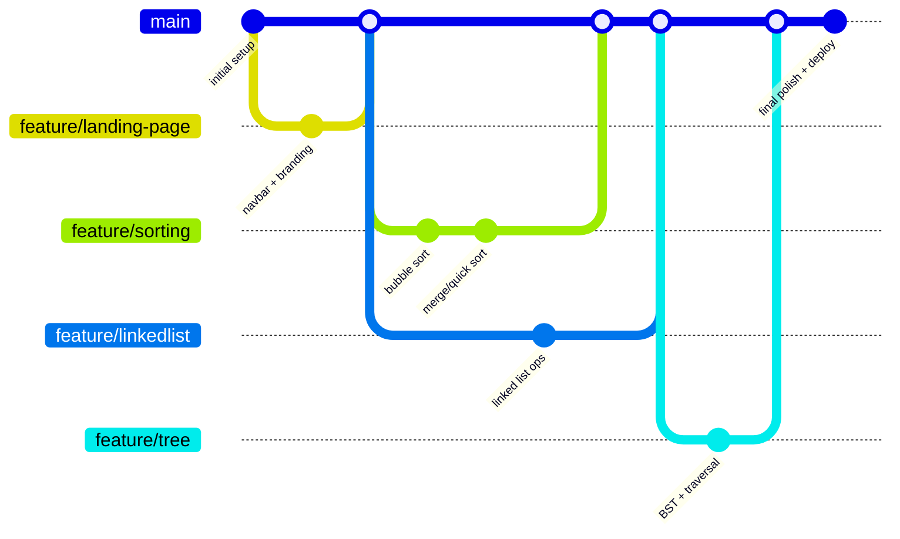
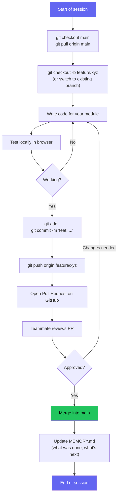

# Git Workflow — DSA Visualizer

## Branch Strategy

## Day-to-Day Flow (what each person actually does)

## Rules Recap
- Never commit directly to `main`
- One feature = one branch = one PR
- Always `git pull` before starting new work
- Update `MEMORY.md` at the end of every session
