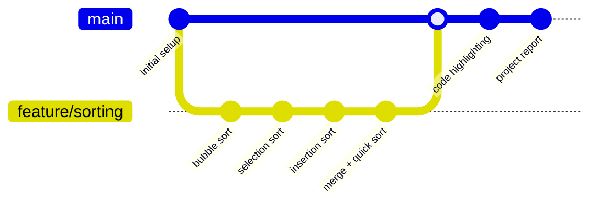
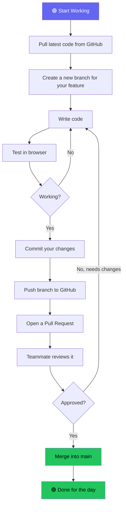

# Git Workflow — DSA Visualizer

This document explains how we use Git and GitHub to manage code changes in this project.

## Branch Strategy

We use a simple branching model: `main` is the stable branch, and each new feature gets its own branch.

## Daily Workflow (Step by Step)

This is what each team member does when they sit down to code:

## Simple Rules

- **Never push directly to `main`** — always use a feature branch
- **One feature = one branch** — keeps things organized
- **Always pull before starting** — avoids merge conflicts
- **Write clear commit messages** — example: `feat: add insertion sort algorithm`
