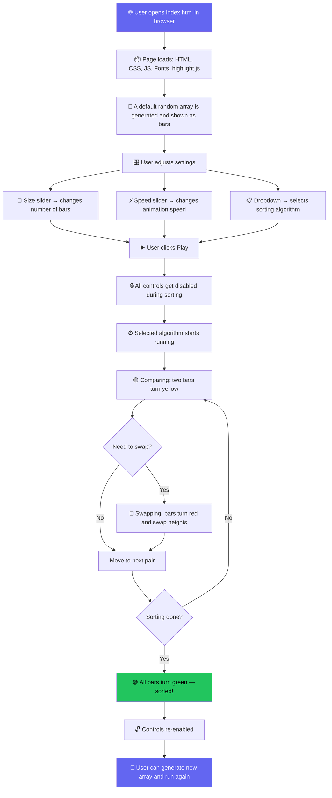

# Application Workflow — DSA Visualizer

This document explains how the application works from start to finish, in plain English.

## Complete User Flow

## What the Colors Mean

| Color | Meaning |
|---|---|
| 🟡 **Yellow** | These two bars are being compared right now |
| 🔴 **Red** | These bars are being swapped |
| 🟢 **Green** | This bar is in its final sorted position |

## Code Panel (Side Panel)

While the bars are animating, the C language reference code on the right side highlights the exact line that matches the current step. This helps connect the visual animation with actual code logic.
