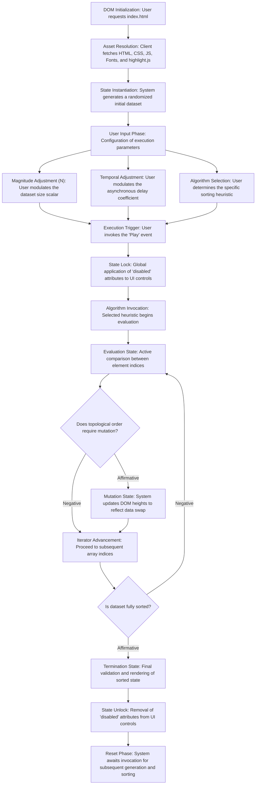

# Application Execution Workflow

This document provides a comprehensive technical overview of the application's runtime execution, detailing the state machine transitions from initialization through algorithmic termination.

## 1. Complete Runtime State Machine

The interaction model is designed to provide deterministic, linear control over algorithmic evaluation while preventing race conditions through strict UI state management.

## 2. Visual Semantic Encoding

The visualization relies on a strict trichromatic encoding system to visually communicate the current state of algorithmic evaluation, effectively minimizing cognitive overload:

| State Indicator | Technical Semantic |
|---|---|
| 🟡 **Evaluation State (Yellow)** | Represents the active logical comparison between two discrete elements within the array space. |
| 🔴 **Mutation State (Red)** | Indicates an active positional swap occurring as a result of the preceding evaluation phase. |
| 🟢 **Sorted State (Green)** | Signifies that an element has mathematically achieved its final, absolute position within the sorted subset. |

## 3. Synchronized Code Telemetry

A critical component of the pedagogical design is the synchronized code reference panel. Through programmatic DOM manipulation, the application highlights specific syntax-colored lines of C reference code synchronously with the visual animation. This functionality establishes a direct cognitive bridge between abstract programmatic instructions (e.g., iterative loops, conditional statements) and their tangible geometric effects on the dataset.
