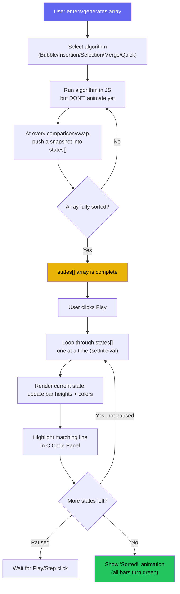
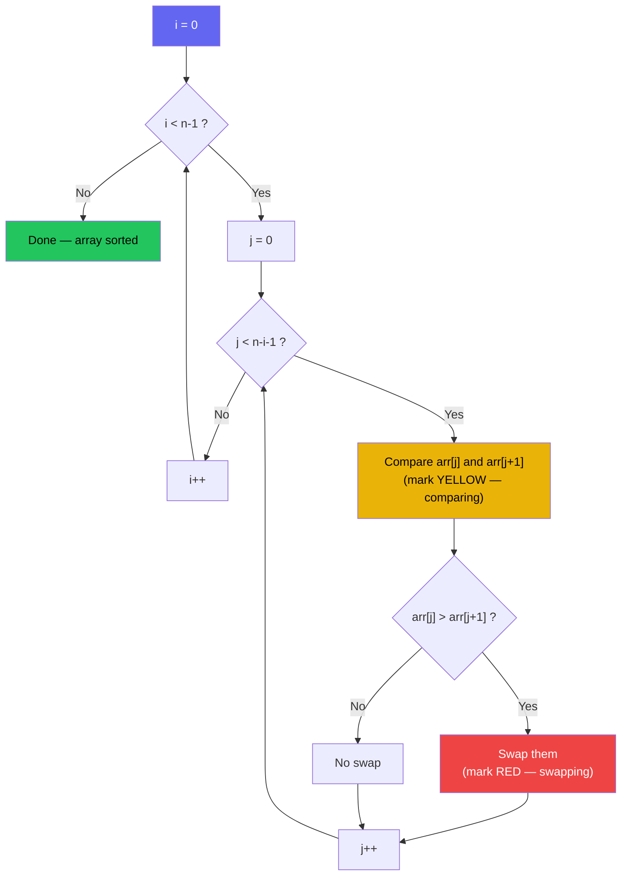

# Sorting Module — Logic Flowchart

## General Pattern (applies to all sorting algorithms)

## Bubble Sort — Specific Logic

## Color Legend (used consistently across all algorithms)
| Color | Meaning |
|---|---|
| 🟡 Yellow | Elements currently being compared |
| 🔴 Red | Elements being swapped |
| 🟢 Green | Sorted / finalized position |
| 🔵 Blue | Current line highlighted in C code panel |
