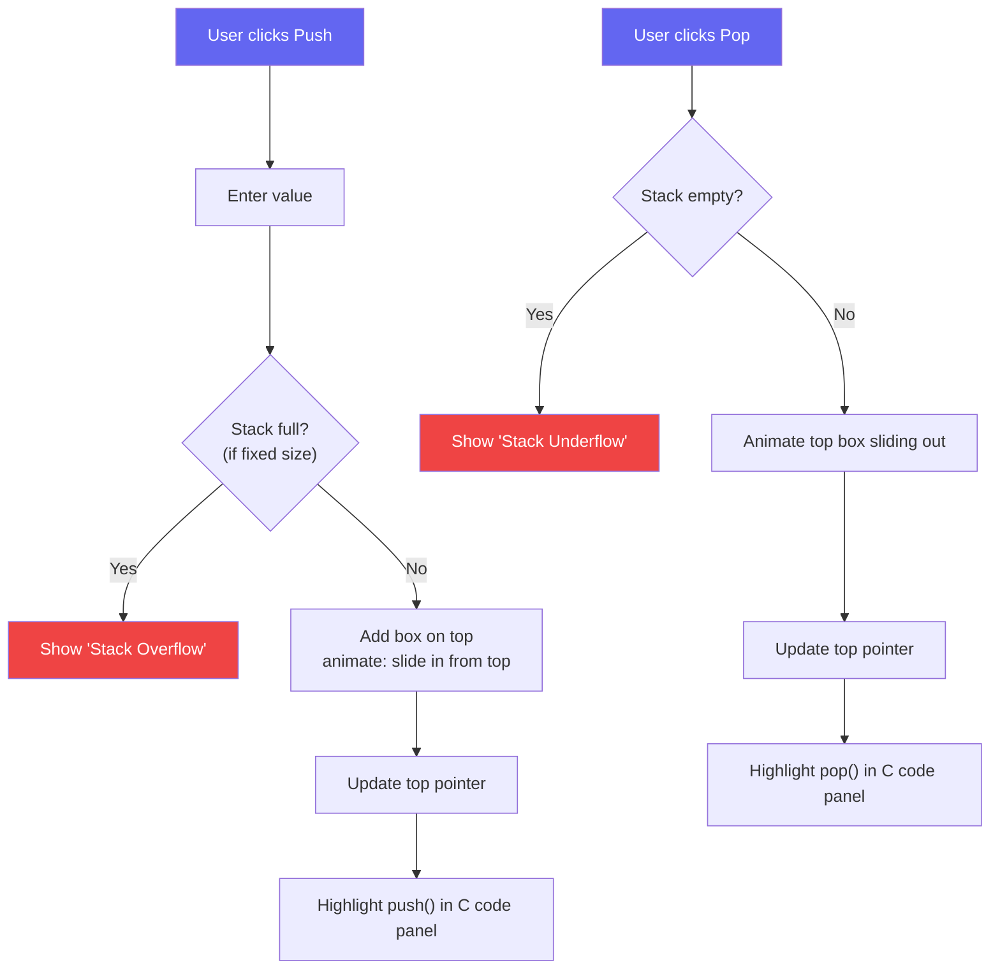
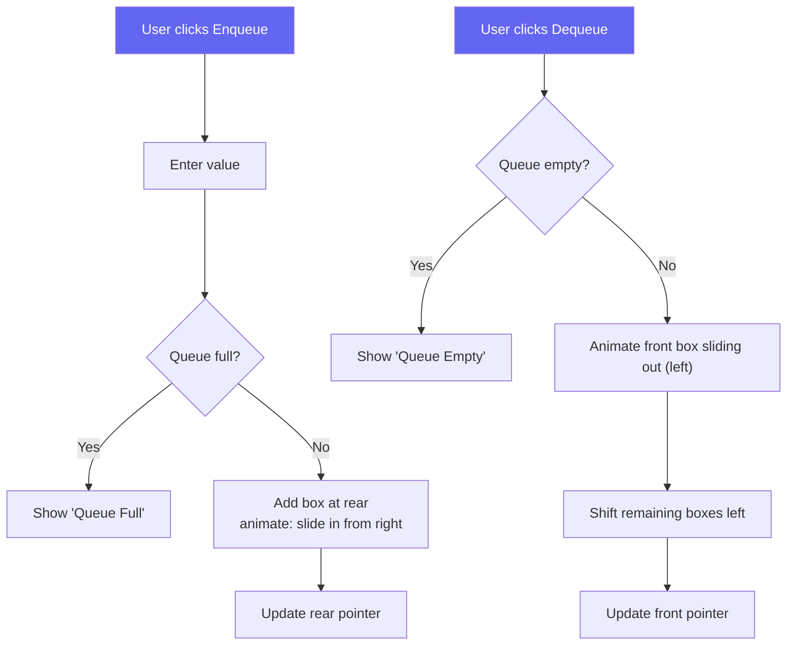
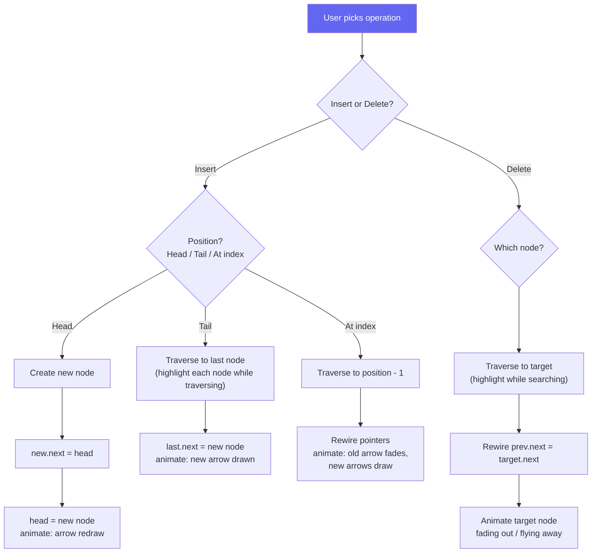
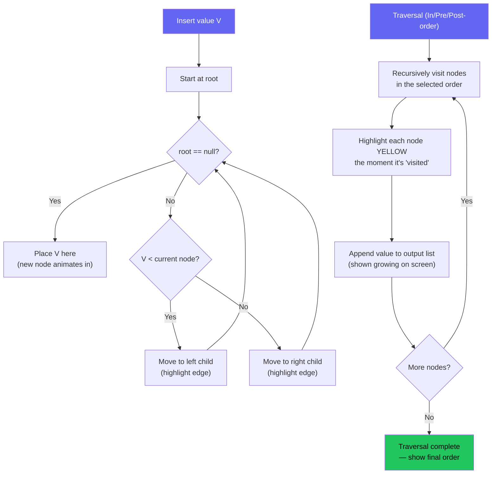

# Data Structure Module — Logic Flowcharts

## Stack — Push/Pop Flow

```mermaid
flowchart TD
    A["User clicks Push"] --> B["Enter value"]
    B --> C{"Stack full?<br/>(if fixed size)"}
    C -->|Yes| D["Show 'Stack Overflow'"]
    C -->|No| E["Add box on top<br/>animate: slide in from top"]
    E --> F["Update top pointer"]
    F --> G["Highlight push() in C code panel"]

    H["User clicks Pop"] --> I{"Stack empty?"}
    I -->|Yes| J["Show 'Stack Underflow'"]
    I -->|No| K["Animate top box sliding out"]
    K --> L["Update top pointer"]
    L --> M["Highlight pop() in C code panel"]

    style A fill:#6366f1,color:#fff
    style H fill:#6366f1,color:#fff
    style D fill:#ef4444,color:#fff
    style J fill:#ef4444,color:#fff
```

## Queue — Enqueue/Dequeue Flow

```mermaid
flowchart TD
    A["User clicks Enqueue"] --> B["Enter value"]
    B --> C{"Queue full?"}
    C -->|Yes| D["Show 'Queue Full'"]
    C -->|No| E["Add box at rear<br/>animate: slide in from right"]
    E --> F["Update rear pointer"]

    G["User clicks Dequeue"] --> H{"Queue empty?"}
    H -->|Yes| I["Show 'Queue Empty'"]
    H -->|No| J["Animate front box sliding out (left)"]
    J --> K["Shift remaining boxes left"]
    K --> L["Update front pointer"]

    style A fill:#6366f1,color:#fff
    style G fill:#6366f1,color:#fff
```

## Linked List — Insert/Delete Flow

```mermaid
flowchart TD
    A["User picks operation"] --> B{"Insert or Delete?"}

    B -->|Insert| C{"Position?<br/>Head / Tail / At index"}
    C -->|Head| D["Create new node"]
    D --> E["new.next = head"]
    E --> F["head = new node<br/>animate: arrow redraw"]

    C -->|Tail| G["Traverse to last node<br/>(highlight each node while traversing)"]
    G --> H["last.next = new node<br/>animate: new arrow drawn"]

    C -->|At index| I["Traverse to position - 1"]
    I --> J["Rewire pointers<br/>animate: old arrow fades,<br/>new arrows draw"]

    B -->|Delete| K{"Which node?"}
    K --> L["Traverse to target<br/>(highlight while searching)"]
    L --> M["Rewire prev.next = target.next"]
    M --> N["Animate target node<br/>fading out / flying away"]

    style A fill:#6366f1,color:#fff
```

## BST — Insert + Traversal Flow

```mermaid
flowchart TD
    A["Insert value V"] --> B["Start at root"]
    B --> C{"root == null?"}
    C -->|Yes| D["Place V here<br/>(new node animates in)"]
    C -->|No| E{"V < current node?"}
    E -->|Yes| F["Move to left child<br/>(highlight edge)"]
    E -->|No| G["Move to right child<br/>(highlight edge)"]
    F --> C
    G --> C

    H["Traversal (In/Pre/Post-order)"] --> I["Recursively visit nodes<br/>in the selected order"]
    I --> J["Highlight each node YELLOW<br/>the moment it's 'visited'"]
    J --> K["Append value to output list<br/>(shown growing on screen)"]
    K --> L{"More nodes?"}
    L -->|Yes| I
    L -->|No| M["Traversal complete<br/>— show final order"]

    style A fill:#6366f1,color:#fff
    style H fill:#6366f1,color:#fff
    style M fill:#22c55e,color:#000
```
