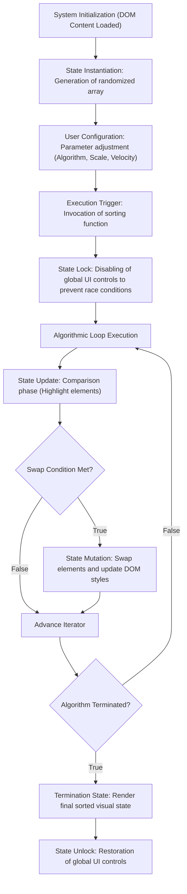

# DSA Visualizer — Project Progress Report

**Project Name:** DSA Visualizer (semicolon;)
**Team:** Rahul, Tushar
**Date:** 22 August 2026
**Status:** In Progress

---

## 1. Introduction and Problem Statement

In the realm of computer science education, the comprehension of Data Structures and Algorithms (DSA) forms the fundamental bedrock for computational thinking and software engineering. However, students frequently encounter cognitive barriers when transitioning from abstract theoretical concepts to practical implementation. Traditional pedagogical methods, heavily reliant on static textbook diagrams and dry trace tables, often fail to capture the dynamic, state-changing nature of algorithmic processes.

The **DSA Visualizer** (project codename: *semicolon;*) is conceptualized as an advanced pedagogical tool engineered to bridge this educational gap. It serves as an interactive, web-based platform designed to elucidate the intricate mechanics of sorting algorithms through dynamic, real-time graphical representations. By visually mapping mathematical operations—such as array traversal, element comparison, and positional swapping—to distinct visual states, the application allows users to observe algorithmic behavior in a highly intuitive manner. Furthermore, the integration of synchronized C-language reference code ensures a direct cognitive link between the visual animation and the underlying programmatic logic.

---

## 2. Technological Infrastructure

The architecture of the application is purposefully constrained to core web technologies, eschewing heavy frameworks to prioritize performance, transparency, and fundamental web development principles.

### 2.1 Core Technologies Utilized

| Technology | Architectural Role |
|---|---|
| **HTML5** | Establishes the semantic structure and Document Object Model (DOM) hierarchy of the application interface. |
| **CSS3** | Dictates the visual presentation through a cohesive dark-mode design system, leveraging custom properties (variables) and hardware-accelerated CSS transitions for fluid state animations. |
| **Vanilla JavaScript** | Serves as the computational engine. It orchestrates DOM manipulation, governs the asynchronous execution flow using Promises, and implements the algorithmic logic directly. |
| **highlight.js** | A lightweight utility integrated via CDN to provide syntax highlighting, enhancing the readability of the C reference code. |
| **Google Fonts** | Defines the typographic hierarchy, utilizing *Poppins* and *Inter* for readability, alongside *Fira Code* for monospace code presentation. |
| **Git & GitHub** | Facilitates version control, collaborative development, and continuous integration workflows. |
| **GitHub Pages** | Provides a robust, zero-configuration hosting environment for static asset deployment. |

### 2.2 Rationale for Excluded Technologies

The deliberate omission of certain modern web technologies was a strategic architectural decision:
- **Backend Frameworks (Node.js/Python):** The computational requirements of the visualizer are strictly client-side; thus, server-side processing introduces unnecessary latency and architectural complexity.
- **JavaScript Frameworks (React/Angular):** Utilizing Vanilla JavaScript ensures the core algorithmic implementations remain transparent and unobfuscated by virtual DOM abstractions or state-management overheads.

---

## 3. Development Progress and Feature Implementation

### 3.1 Completed Milestones ✅

The core visualization engine and the primary sorting algorithms have been successfully implemented and rigorously tested.

| Feature Module | Technical Description | Status |
|---|---|---|
| **Interface Architecture** | Development of a responsive, dark-mode graphical user interface (GUI). | ✅ Completed |
| **State Generation** | Algorithmic generation of randomized numerical arrays mapped to DOM elements. | ✅ Completed |
| **Animation Engine** | Implementation of an asynchronous execution loop utilizing `Promise`-based timeouts to govern animation cadence. | ✅ Completed |
| **Bubble Sort** | Implementation of the $O(n^2)$ exchange sort with adjacent element comparison highlighting. | ✅ Completed |
| **Selection Sort** | Implementation of the in-place comparison sort, featuring real-time tracking of the minimum topological value. | ✅ Completed |
| **Insertion Sort** | Implementation of the adaptive sorting algorithm, demonstrating the dynamic shifting of sorted sub-arrays. | ✅ Completed |
| **Merge Sort** | Implementation of the $O(n \log n)$ divide-and-conquer paradigm, featuring recursive partitioning and merging visualizations. | ✅ Completed |
| **Quick Sort** | Implementation of the partition-exchange sort, illustrating pivot selection and sub-array partitioning. | ✅ Completed |
| **Runtime Controls** | Interactive sliders binding to state variables for real-time manipulation of array magnitude and animation velocity. | ✅ Completed |
| **Code Synchronization** | A reactive side-panel that maps the current execution state to specific lines of C code. | ✅ Completed |
| **Complexity Analysis** | Dynamic rendering of Big-$O$ asymptotic time and space complexities corresponding to the active algorithm. | ✅ Completed |

### 3.2 Scheduled Objectives 🔲

Future development iterations will expand the scope of the application to include non-linear data structures and advanced metrics.

| Feature Module | Technical Description | Status |
|---|---|---|
| **Data Structure Traversals** | Visualizing operations on Linked Lists, Stacks, Queues, and Binary Trees. | 🔲 Pending |
| **Performance Metrics** | A quantitative step counter to empirically track runtime comparisons and memory swaps. | 🔲 Pending |
| **Responsive Optimization** | Enhancing viewport adaptability for seamless mobile device interaction. | 🔲 Pending |

---

## 4. System Architecture and Workflow

### 4.1 Execution Flow

The application lifecycle follows a deterministic, state-driven workflow:

### 4.2 Visual Semantics

To reduce cognitive load, the visualization engine employs a strict color-coded semantic system during execution:
- **Yellow:** Denotes the active evaluation or comparison of elements.
- **Red:** Signifies a state mutation (a positional swap of elements).
- **Green:** Indicates that an element has reached its final, asymptotically sorted position.

---

## 5. Conclusion

The *semicolon;* DSA Visualizer has successfully established a robust, client-side execution environment capable of demonstrating foundational sorting algorithms with high visual fidelity. By eschewing external dependencies in favor of pure HTML, CSS, and JavaScript, the project not only serves as an educational tool for its end-users but also stands as a testament to the capabilities of native web technologies. The immediate next steps involve the expansion of the visualization library to encompass abstract data types and the finalization of the production deployment pipeline.
